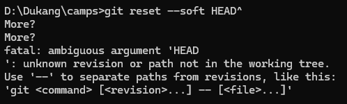

重置当前 HEAD 到指定的状态

## 关于在`Windows`系统的`cmd`命令行执行出现 `More?`的说明

当我要`reset`当前`commit`的内容时，使用`windows`的`cmd`，然后输入 `git reset --soft HEAD^` 后就显示 `more?`，多按几次回车后
出现了下图的情况。

这是因为 `cmd` 控制台中换行符默认是 `^`，而不是 `\`，所以它的 `more?` 的意思是问你下一行是否需要再输入，而 `^` 符号就被当做换行符而被 `git` 命令忽略掉了。

解决方法有如下几种

- 加引号：`git reset --hard "HEAD^"`
- 加一个`^`：`git reset --hard HEAD^^`
- 换成`~`：`git reset--hard HEAD~` 或者 `git reset --hard HEAD~1`，后面的数字表示回退几次提交，默认是一次
- 当然还可以换成 `git bash`、`powershell` 等就不会出现这种问题了

## `git reset --soft HEAD^` 和 `git reset --hard HEAD^`

`git reset --soft HEAD^` 是撤销`commit`，但是 `add` 不会撤销

`git reset --hard HEAD^` 直接撤销 `add` 了

**注意：** `reset` 命令只能回滚最新的提交，无法满足保留最后一次提交只回滚之前的某次提交。

### 命令解释

- `HEAD^` 表示上一个版本，即上一次的 `commit`，几个`^`代表几次提交，如果回滚两次就是 `HEAD^^`。也可以写成 `HEAD~1`，如果进行两次的`commit`，想要都撤回，可以使用 `HEAD~2`

- `--soft` 不删除工作空间的改动代码，撤销 commit，不撤销 add

- `--hard` 删除工作空间的代码，撤销 commit 且撤销 add

## 如果你已经 push 了想回退

1. 本地回退，回退到上一次提及： `git reset --hard HEAD^`
2. 远程回退，然后强制推送当前版本到远端：`git push origin HEAD`

## 总结

[官方文档](https://git-scm.com/docs/git-reset/zh_HANS-CN)
